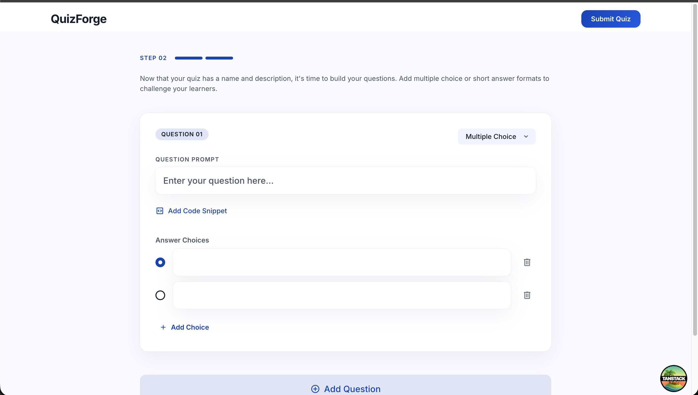
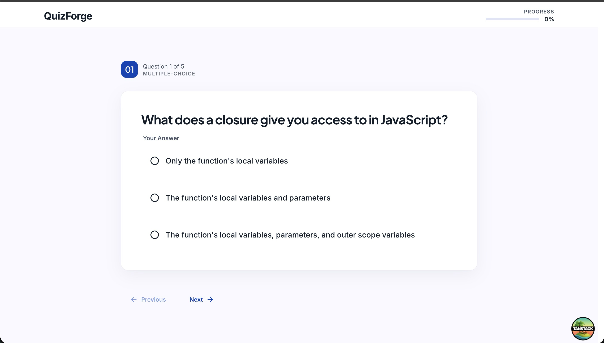

# Quiz Maker: Frontend





## Prerequisites

- [Node.js](https://nodejs.org/) (v18 or higher recommended)

## Setup

```bash
cd frontend
npm install
cp .env.example .env
```

## Run Locally

```bash
npm run dev
```

The frontend connects to the backend at `http://localhost:4000` by default (configured in `frontend/src/entities/quiz/api/client.ts`).

Start the backend first — see `backend/README.md` for instructions.

## Available Scripts

| Command             | Description                      |
| ------------------- | -------------------------------- |
| `npm run dev`       | Start dev server on port 3000    |
| `npm run build`     | Production build                 |
| `npm run preview`   | Preview production build         |
| `npm run test`      | Run Vitest unit tests            |
| `npm run lint`      | ESLint + FSD architecture linter |
| `npm run storybook` | Start Storybook on port 6006     |

App runs at [http://localhost:3000](http://localhost:3000).

## Architectural Decisions

### Stack & Rationale

| Category         | Choice                | Why                                                                               |
| ---------------- | --------------------- | --------------------------------------------------------------------------------- |
| Routing          | TanStack Router       | Type-safe, file-based route generation, seamless integration with TanStack Query  |
| Data Fetching    | TanStack Query        | Server state management with caching, retry, and optimistic updates built-in      |
| State Management | Zustand               | Minimal boilerplate, easy session persistence, clear separation from server state |
| Styling          | Tailwind CSS          | Rapid UI development, consistent design tokens, zero runtime overhead             |
| Forms            | React Hook Form + Zod | Type-safe validation, minimal re-renders, great DX                                |
| UI Primitives    | Radix UI              | Headless (no style conflicts), accessible by default, fully customizable          |

### Design System

Refer to [frontend/DESIGN.md](./frontend/DESIGN.md) for the full design system documentation. It defines our visual language, component specs, and the "Sapphire Architectural" aesthetic. Storybook (`npm run storybook`) serves as the living component showroom.

A design system was created to keep the product visually cohesive as it scales — ensuring every screen feels like part of the same product rather than independently built features. It accelerates development by giving engineers documented components to reference, aligns designers and developers through a shared source of truth, and helps new team members onboard faster by learning established patterns rather than inferring intent from disparate implementations.

### Structure (Feature-Sliced Design)

```
src/
├── app/          # Router, providers, app-wide config
├── entities/     # Business domain entities (quiz, questions)
├── pages/        # Page components with model/ui separation
├── shared/       # Cross-cutting UI (buttons, inputs, etc.)
└── widgets/      # Composed UI blocks
```

**Why FSD**: Clear ownership boundaries, self-documenting structure, well-established in the frontend community with active maintenance and tooling support (e.g., [`steiger`](https://github.com/feature-sliced/steiger) linter). See [feature-sliced.design](https://feature-sliced.design) for the official documentation.

### Key Patterns

**State Management**  
Complex UIs (quiz builder, quiz player) use Zustand stores with session persistence. All editing, answering, and navigation happen locally in the store during the session. No API calls are made until the user explicitly submits — this keeps the UX snappy and resilient to network issues.

**API Integration**  
API calls are deferred to submission time and executed as a batch of concurrent requests. This pattern:

- Keeps the happy path fast (no network round-trips per action)
- Handles partial failures gracefully (some questions save, others retry)
- Provides clear user feedback on what succeeded vs. failed

Example flows:

- **Builder**: Questions created via `Promise.all` → if some fail, remaining are marked and user can retry
- **Player**: Answers submitted via `Promise.allSettled` → failed answers tracked and can be retried

## Anti-Cheat Design

The quiz player records behavior events (tab switches, paste attempts, window blur, devtools opened, etc.) rather than blocking actions.

**Frontend tracking**: `visibilitychange` and `paste` events (the latter scoped to answer input fields) increment counters in the active quiz Zustand store (persisted to session storage per attempt). After submission, `CompletedQuizState` displays an "Integrity Tracker" summary — a deterrent without enforcement friction.
